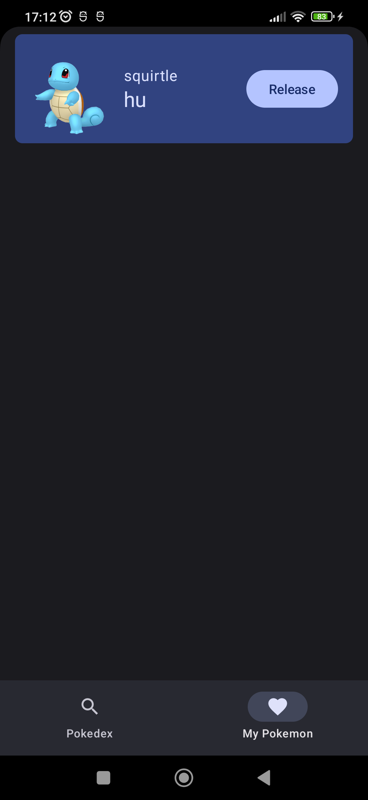

# pokedex Apps
This is simple pokemon directory app, you can catch the pokemon and make it yours.
The project integrate with https://pokeapi.co/ to get pokemon list.

## Screenshot
  

  

  

  
  

## PokeAPI

Pokedex uses [PokeAPI](https://pokeapi.co/) for fetching data related to Pokémon.

## How to run this 
- Download JDK 17 ([link](https://www.oracle.com/java/technologies/javase/jdk17-archive-downloads.html))
- Change project setting JDK to 17
- Apply
- Rebuild project

## Tech Stack
- Design Pattern: MVVM
- Networking: Retrofit
- Dependency Injection: Hilt
- UI Framework: Jetpack compose
- Database: Room Db
- Others:
  - Navigation compose
  - Jetpack paging lib
  - Material 3
  - Coroutine

## Structure
- Single activity, multi compose screen
- UI Layer: compose, view model
- Domain: use cases
- Data: repositories, api service
